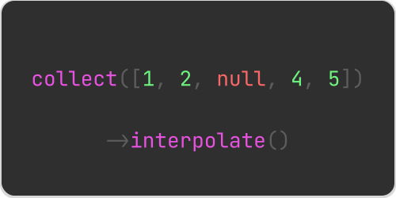

# Laravel Collection Interpolate

This humble Laravel package extends Laravel's built-in Collection methods with
a method for performing linear and time-aware interpolation on the values of
the collection.

## Installation

This package is distributed on Packagist via Composer, and can be installed
with the following command:

```bash
composer require hedger/laravel-collection-interpolate
```

## Usage

This package extends the `Illuminate\Support\Collection` class with a new `interpolate` macro. By default, the `interpolate` method will perform linear interpolation on the values of the collection, but it can also be used to perform time-aware interpolation.

### Linear interpolation

Linear interpolation is best for datasets with evenly spaced values, where 
missing points are filled by a straight-line estimate between two known values.
It's simple and effective for scenarios without a time-based component.

```php
$values = collect([1, 2, null, 4, 5])->interpolate();

$values->all(); // [1, 2, 3, 4, 5]
```

#### Complex value objects

When the value to be interpolated is not the items's value itself, but a deeply 
nested field within a value object, you can provide a custom `valuePath` 
parameter to the `interpolate` method.

```php
$values = collect([
    ['data' => ['reading' => 1]],
    ['data' => ['reading' => 2]],
    ['data' => ['reading' => null]],
    ['data' => ['reading' => 4]],
    ['data' => ['reading' => 5]],
])->interpolate(valuePath: 'data.reading');
```

### Time-aware interpolation

Time-aware interpolation is ideal when data points are irregularly spaced or 
influenced by time, as it accounts for the time difference between points to 
provide more accurate interpolations in temporal contexts.

> [!WARNING] Sort the collection before using time-aware interpolation.
> When using time-aware interpolation, you **MUST** sort the collection in 
> ascending order. The `sortKeys` method is a convenient way to do this
> when the collection is keyed by timestamps.
>
> If your collection is not keyed by timestamps, use the `sortBy` method
> to sort the collection by the timestamp field before calling `interpolate`.

```php
$values = collect([
    ['2025-01-01' => 1],
    ['2025-01-02' => 2],
    ['2025-01-04' => null],
    ['2025-01-05' => 5],
])->sortKeys()
  ->interpolate(mode: 'time');

$values->all(); 

// [
//     ['timestamp' => '2021-01-01', 'value' => 1],
//     ['timestamp' => '2021-01-02', 'value' => 2],
//     ['timestamp' => '2021-01-04', 'value' => 4],
//     ['timestamp' => '2021-01-05', 'value' => 5],
// ]
```

#### Complex value objects

Similar to linear interpolation, you can provide a custom `valuePath` parameter
to the `interpolate` method when the value to be interpolated is not the items's
value itself, but a deeply nested field within a value object.

```php
$values = collect([
    ['2025-01-01' => ['data' => ['reading' => 1]]],
    ['2025-01-02' => ['data' => ['reading' => 2]]],
    ['2025-01-04' => ['data' => ['reading' => null]]],
    ['2025-01-05' => ['data' => ['reading' => 5]]],
])->sortKeys()
  ->interpolate(
      mode: 'time', 
      valuePath: 'data.reading',
  );
```

#### Custom timestamp field

The interpolate method assumes the collection is keyed by timestamps, but if 
the timestamps are stored within a value object, you can specify a custom 
`timePath` parameter.

```php
$values = collect([
    ['data' => ['timestamp' => '2025-01-01', 'reading' => 1]],
    ['data' => ['timestamp' => '2025-01-02', 'reading' => 2]],
    ['data' => ['timestamp' => '2025-01-04', 'reading' => null]],
    ['data' => ['timestamp' => '2025-01-05', 'reading' => 5]],
])->sortBy('data.timestamp')
  ->interpolate(
      mode: 'time', 
      valuePath: 'data.reading',
      timePath: 'data.timestamp',
);
```

## License

This package is open-source software licensed under the [MIT license](LICENSE.md).

Copyright &copy; 2025 Nicolas Hedger
